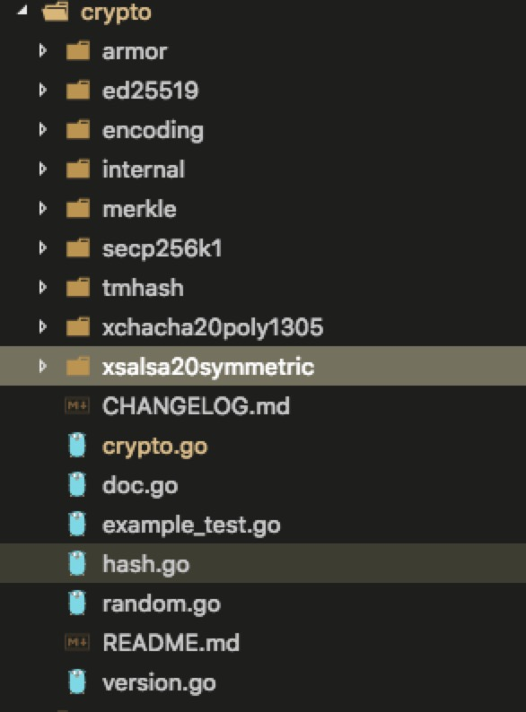

先看一下crypto的文件夹:




简单列一下各个目录的功能:

* armor 这是一个数据编码包 主要用在电子邮件加密中
* ed25519 这个是EdDSA加密算法的一种实现
* encoding 这个是Tendermint使用go-amino包对公钥和私钥进行序列化 go-amino类似于以太坊的RLP的一种二进制序列化和反序列化工具
* merkle merkle的实现包
* secp256k1 这个是ECDSA加密算法的一种实现 关于EdDSA, ECDSA, SHA等和加密相关的术语 下面我会简单说明一下
* tmhash 这个是对sha256hash的封装
* xchacha20poly1305 对称加密aead算法的一种实现
* xsalsa20symmetric 暂时不知作用是什么 也没发现Tendermint有其他模块调用


### armor包
armor中只有两个函数`EncodeArmor`和`DecodeArmor` 

OpenPGP Armor
OpenPGP是使用最广泛的电子邮件加密标准。它由Internet工程任务组（IETF）的OpenPGP工作组定义为RFC 4880中的建议标准.OpenPGP最初源自由Phil Zimmermann创建的PGP软件。

虽然OpenPGP的主要目的是端到端加密电子邮件通信，但它也用于加密消息传递和其他用例，如密码管理器。

OpenPGP的加密消息，签名证书和密钥的基本描述是八位的字节流。为了通过不能保障安全的网络通道传输OpenPGP的二进制八位字节，需要编码为可打印的二进制字符。OpenPGP提供将原始8位二进制八位字节流转换为可打印ASCII字符流，称为Radix-64编码或ASCII Armor。

ASCII Armor是OpenPGP的可选功能。当OpenPGP将数据编码为ASCII Armor时，它会在Radix-64编码数据中放置特定的Header。OpenPGP可以使用ASCII Armor来保护原始二进制数据。OpenPGP通过使用Header告知用户在ASCII Armor中编码了什么类型的数据。
ASCII Armor的数据结构如下：
  * Armor标题行，匹配数据类型
  * Armor Headers
  * A Blank（零长度或仅包含空格）行
  * The ASCII-Armored data
  * An Armor Checksum
  * The Armor Tail，取决于护甲标题线

具体格式:
```shell
-----BEGIN PGP MESSAGE-----

Version: OpenPrivacy 0.99


yDgBO22WxBHv7O8X7O/jygAEzol56iUKiXmV+XmpCtmpqQUKiQrFqclFqUDBovzSvBSFjNSiVHsuAA==

=njUN

-----END PGP MESSAGE-----
```

### encoding 包
```go
func PrivKeyFromBytes(privKeyBytes []byte) (privKey crypto.PrivKey, err error) {
	err = cdc.UnmarshalBinaryBare(privKeyBytes, &privKey)
	return
}

func PubKeyFromBytes(pubKeyBytes []byte) (pubKey crypto.PubKey, err error) {
	err = cdc.UnmarshalBinaryBare(pubKeyBytes, &pubKey)
	return
}
```
encoding主要就是这两个比较重要的函数, 分别是反序列化私钥和反序列化公钥`crypto.PrivKey`和`crypto.PubKey`是两个接口 我们下面说一下这两个接口

### crypto.go文件
当前文件定义了两个重要的接口 
```go
type PrivKey interface {
	Bytes() []byte
	Sign(msg []byte) ([]byte, error)
	PubKey() PubKey
	Equals(PrivKey) bool
}

// An address is a []byte, but hex-encoded even in JSON.
// []byte leaves us the option to change the address length.
// Use an alias so Unmarshal methods (with ptr receivers) are available too.
type Address = cmn.HexBytes

type PubKey interface {
	Address() Address
	Bytes() []byte
	ByteArray() []byte
	VerifyBytes(msg []byte, sig []byte) bool
	Equals(PubKey) bool
}
```
这两个接口很明显能看出是想对非对称加密的公钥和私钥进行统一。 目前crypto模块中实现这两个接口的签名算法有两个一个是ed25519一个是secp256k1。 也就是说在Tendermint中。 可以使用这两种加密算法进行加密，验签。


### 加密的一些术语说明

加密可以分为非对称加密和对称加密两种。 对称加密就是通过密码进行加密和解密。 比如AES。 但是因为需要密码才能解密， 就会涉及到密码流转问题。 
非对称加密会有公钥和私钥。 我们可以用私钥去对一串内容进行签名， 那么公钥的拥有者就可以验证这串内容是否确定是私钥拥有者发出的。 这个过程被称为加签和验签。
同时公钥方可以对一串内容进行加密。 这样只有私钥拥有者才能解开加密的内容。这个过程被称为加密和解密。
非对称加密的使用领域特别广泛， CA证书，API支付，到现在我们在区块链上的使用等等。 这里我不打算详细讲解这些东西， 因为我也不是专业的。 只是大致介绍一下。
非对称加密主要有RSA和ECC两类。 目前在各个实现的区块链中主要是ECC这种， 关于RAS我在此处就不在说明了。


* ECC (Elliptic curve crypto) 椭圆曲线加密
* ECDH（Elliptical Curve Diffle-Hellmen） 椭圆曲线秘钥交换算法 
* ECDSA (Elliptical Curve Digital Signature Algorithm)椭圆曲线数字签名算法
* EdDSA(Edwards-Cure Digital SIgnature Algorithm)

 -  Ed25519是EdDSA签名簇方案中的一个实现。它被描述在RFC8032中。 该签名家族方案中还有Ed448。 Ed25519使用的椭圆曲线为curve25519

 - ECDSA是和EdDSA没有太大关系的另一种签名方案。ECDSA的所有实例均是不兼容的。 如scep256k1算法。 scep256k1确定了椭圆曲线的轨迹，scep256k1描述的椭圆曲线为y^2 = x^3 + 7

### ed25519与secp256k1包

这两个包中是对上述PrivKey和PubKey的具体实现。ed25519是Tendermint自己代码实现的， secp256k1调用了btcsuit相关的代码。


### tmhash 包
```go
// Sum returns the first 20 bytes of SHA256 of the bz.
func Sum(bz []byte) []byte {
	hash := sha256.Sum256(bz)
	return hash[:Size]
}

```

这个包只有一个重要的函数, 只是封装了go自带的sha256的hash函数而已

### merkle包

```
                        *
                       / \
                     /     \
                   /         \
                 /             \
                *               *
               / \             / \
              /   \           /   \
             /     \         /     \
            *       *       *       h6
           / \     / \     / \
          h0  h1  h2  h3  h4  h5
```
默克尔数在各种公链中都有应用。主要是进行校验数据。 在以太坊中使用的是更复杂的默克尔前缀数。 除了有校验功能还可以加快查询速度。 

Tendermint中的merkle包中核心函数如下
```go
func simpleHashFromHashes(hashes [][]byte) []byte {
	// Recursive impl.
	switch len(hashes) {
	case 0:
		return nil
	case 1:
		return hashes[0]
	default:
		left := simpleHashFromHashes(hashes[:(len(hashes)+1)/2])
		right := simpleHashFromHashes(hashes[(len(hashes)+1)/2:])
		return SimpleHashFromTwoHashes(left, right)
	}
}

func SimpleHashFromTwoHashes(left, right []byte) []byte {
	var hasher = tmhash.New()
	err := encodeByteSlice(hasher, left)
	if err != nil {
		panic(err)
	}
	err = encodeByteSlice(hasher, right)
	if err != nil {
		panic(err)
	}
	return hasher.Sum(nil)
}
```
进行递归hash运算知道生成最终的根hash。 这个包中还有一个对map求merkle的方法， 将map中的key根据byte比较`bytes.Compare`排序生成对应的value数组再进行hash运算得到最终的根hash。 

### 加密扩展

整个模块差不多就是这么多内容， 可能用的比较多的就是签名，加解密以及默克尔树这个地方。 但是在我使用加密包进行交易签名和验证的时候， 发现这个包的功能可能达不到我的要求。

先说为什么:
> 我们在这个包中可以看到如果要验签是需要公钥的。所以说如果我创建一个自己的链就需要保存地址对应的公钥才能对交易进行交易验证。

那可不可以不保存这种对应关系呢？

> 在以太坊源码中我们可以看到以太坊是不需要保存账户的公钥就可以交易这笔交易是否有效的？  这是如何做到的呢？ 在以太坊进行交易校验时, 根据交易序列化的内容， 签名的内容是可以反退出公钥的，然后根据公钥进行地址生成，将生成的地址和交易的from地址相比较是否一致就可以判定出此交易是否有效了。
说到这里也说一说自己曾经在以太坊中遇到的一个小问题， 有一次用私钥离线签名进行转账时geth节点总是会报余额不足的问题， 当时很纳闷， 自己的from地址明明余额是足够的， 后来追踪源码的时候才发现，节点根本不会直接用你发送来的交易中的from来验证余额， 而是根据签名自己推导出地址， 由于自己私钥和地址不匹配。所有就出现了这个问题。

既然可以根据签名反推出公钥, 然后阅读了一下btcsuite的代码发现可以扩展一下这个包。 我只扩展了secp256k1的加密关于ed25519我没有具体分析，不知道是否可以反推出公钥。
```
// 类似下面这个函数:
func RecoverPublicKey(sign, hash []byte) (crypto.PubKey, error) {
	pubkeyObj, _, err := secp256k1.RecoverCompact(secp256k1.S256(), sign, hash)
	if err != nil {
		return nil, err
	}
	var pubkeyBytes PubKeySecp256k1
	copy(pubkeyBytes[:], pubkeyObj.SerializeCompressed())
	return pubkeyBytes, nil
}
```

## 总结

关于密码学， 我觉得其实没有大家想的那么简单。 有很多数学原理在其中， 对于我本人也只是知道一些名词， 知道如何使用一些代码包。 吾生也有涯，而知也无涯。唉。


